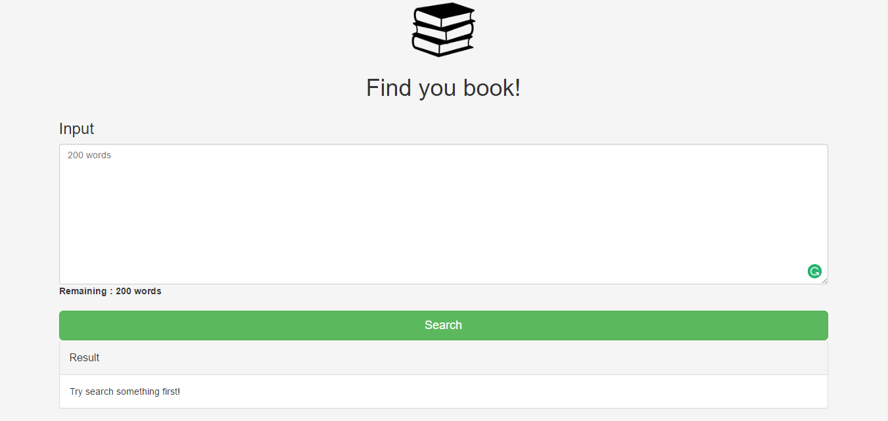
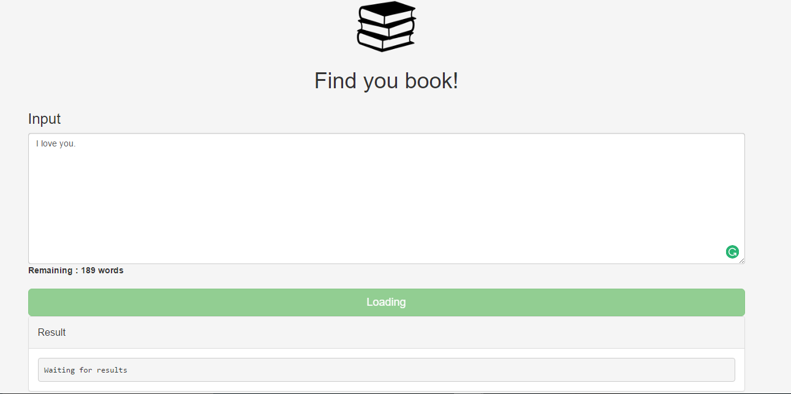
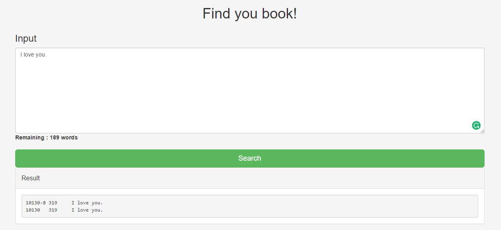
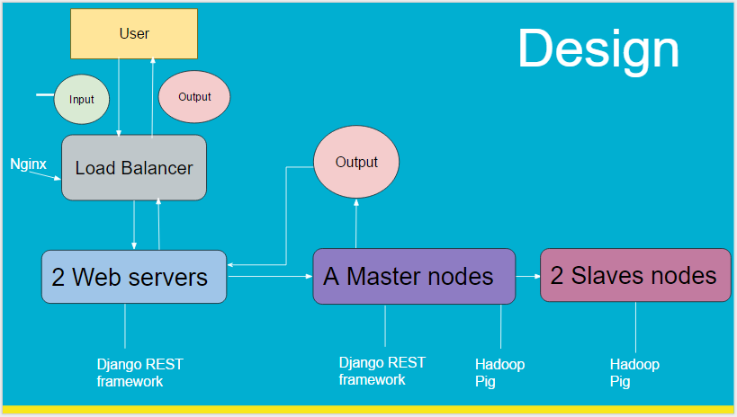

#Web App Final Project

Our main page is the following link: http://52.221.229.121/static/index.html#/

## Member List

<table style="width:100%">
  <tr>
    <th>Name</th>
    <th>StudentID</th>		
    <th>GitHub</th>
  </tr>
  <tr>
    <td>Sorrawit Chancherngkit</td>
    <td>5610545811</td>		
    <td>@OngOngoing</td>
  </tr>
  <tr>
    <td>Thanachote Visetsuthimont</td>
    <td>5610545692</td>		
    <td>@thanachote-Frank</td>
  </tr>
  <tr>
    <td>Perawith Jarunithi</td>
    <td>5610546281</td>		
    <td>@jarunithi</td>
  </tr>
   <tr>
    <td>Nathas Yingsukamol</td>
    <td>5610546753</td>		
    <td>@new08242</td>
  </tr>
   <tr>
    <td>Kittinan Napapongsa</td>
    <td>5610546681</td>		
    <td>@kittinan1</td>
  </tr>
    <tr>
    <td>Worapon Olanwanitchakul</td>
    <td>5610546290</td>		
    <td>@smart2538</td>
  </tr>
</table>

##Web screenshot

* MainPage

* Input

* Result

#Short Report

##How we design and implement our project
* Architecture Design

For the load balancer, we decide to use Nginx because we are familiar with it and we have limited time.
We don't have enough time to learn new tools.
Also the decision using Django for Web application, we have the same reason as Nginx.
We use Hadoop and Pig for the map&reduce work.

* Server

1. Load balancer - 52.221.229.121
2. Web server - 52.77.248.211, 52.77.242.91
3. Master node - 52.221.255.33
4. Slave node - 54.169.118.41, 54.169.118.83
